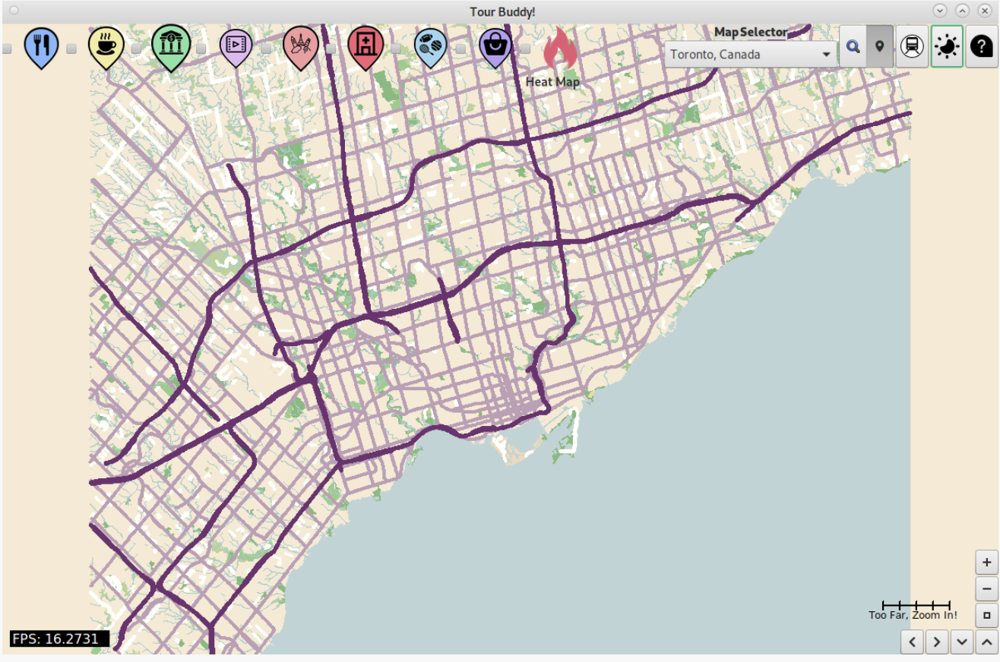
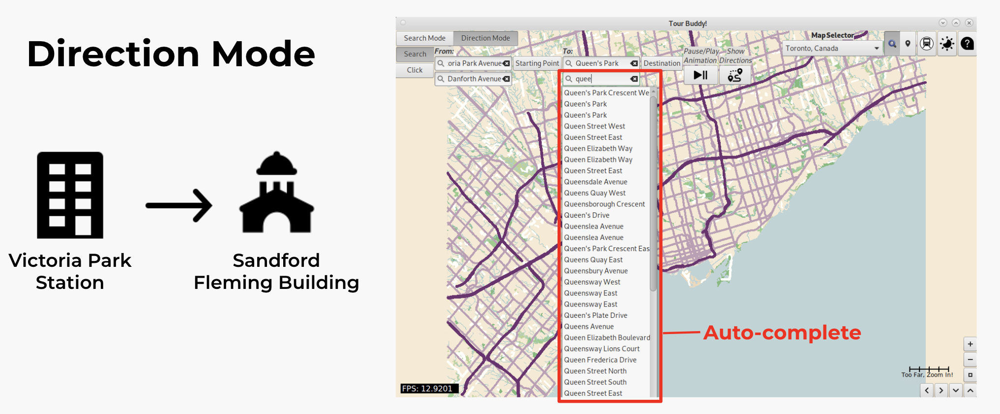
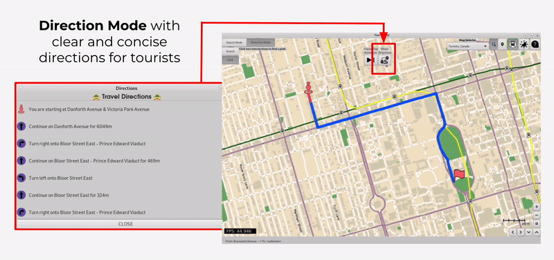
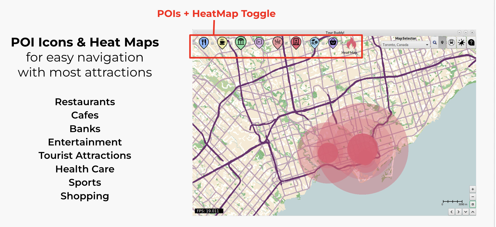
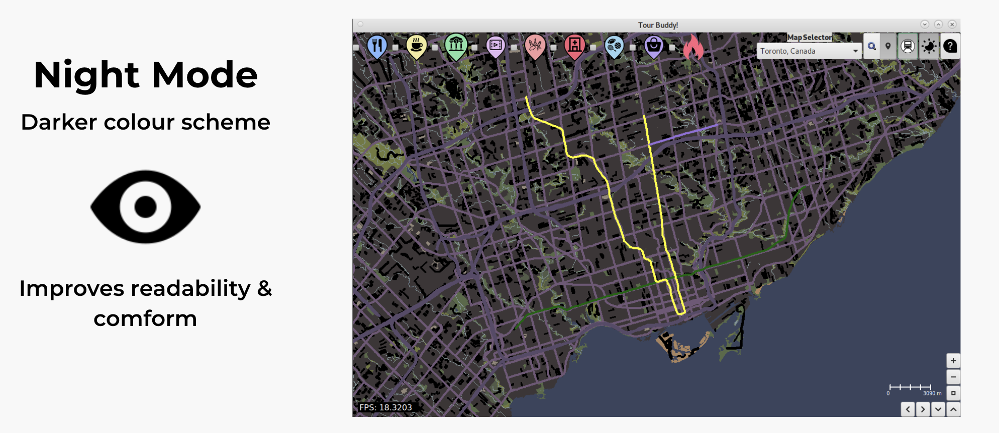
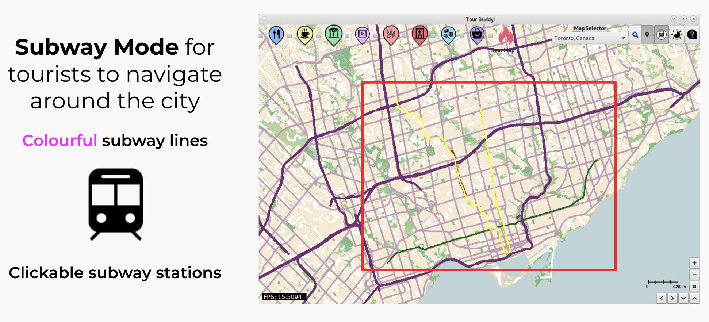

# Tour-Buddy

**Tour-Buddy** is a Geographic Information System (GIS) application designed for tourists, offering features similar to Google Maps. It helps users navigate unfamiliar cities while providing valuable insights into popular attractions and local amenities. Developed as part of a team of 3 for my ECE297 course, the application was built using the OpenStreetMap API, GTK, and Glade. With features like heat maps, night mode, and detailed directions, **Tour-Buddy** enhances travel experiences by making navigation intuitive and informative.

    

**Due to school policy, the code cannot be posted publicly.**

# Key Features

## Direction & Search Mode
Get precise navigation instructions from any location to your destination, accompanied by an animation showing how to get there.

**Search Screenshot**:  

    
    
Screenshot of the search functionality

## Directions and Animation

    

## Heat Maps
Visualize popular locations near tourist attractions using topographic heat maps, including restaurants, cafes, and more.

    
    
Topographic heat map example

## Night Mode
Adjusts the interface for better visibility in low light.

    
    
Night mode interface

## Subway Mode
Displays subway lines and stations, making it easier to find your way.

    
    
Subway lines overview

## Algorithms and Data Management

- **Route-Finding**: Utilized Dijkstra and A* algorithms for efficient pathfinding.
- **Data Structures**: Implemented Tries and sorted maps to manage data effectively.

# Thank You for Viewing
Thank you for taking the time to explore **Tour-Buddy**! We hope this application enhances your travel experience and provides valuable insights for navigating the city.

If you have any questions or feedback, please feel free to reach out!
